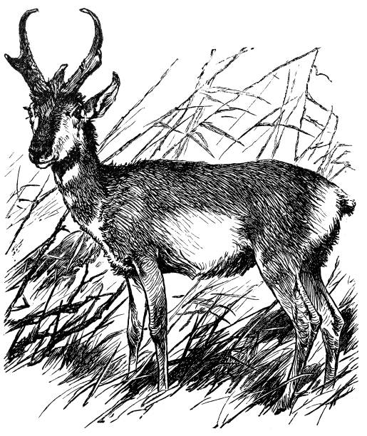

<h2>What is <i>BurlyPronghorn</i></h2>  
Burly Pronghorn is <i>habits, tasks and dreams tracking tool</i> that operates on several microservices. Central part is API which main goal is to put data into MongoDB database and also get records from it.
Two other applications that are not being implemented yet will be Android App (probably powered by Kivy) and Flask App.

<h2>About Pronghorn</h2>  
Pronghorn <i>(Antilocapra americana) </i> is the only living representative of the genus Pronghorn. It is the fastest animal in North America, which can reach up to 95km/h, making jumps up to 6 meters long. In the first half of the twentieth century, due to the conversion of the prairie into agricultural land, the pronghorn population decreased significantly. At that time, the hunting of these antelopes was banned and they were re-settled in formerly occupied areas, as a result of which many farmers had to leave their farms. The pronghorn antelope has become a symbol of environmental protection in Canada and the United States. This animal was chosen as mascot for this project to raise awareness, that limiting the impact of the human footprint and restoring the natural habitats of animals may cause the population of endangered species to increase significantly in a short time.

\
<i>source:</i> [Pronghorn - Wikipedia](https://en.wikipedia.org/wiki/Pronghorn)

<h2>How to install</h2>  

<h3>Docker compose</h3>    
Clone repository and simply run `docker compose up` command in main directory
